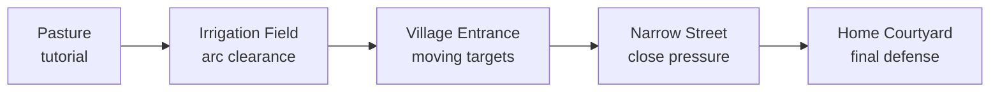

# Your First Unreal Editor Session

The code foundation is ready. Your first job in Unreal is to turn the supplied test space into **our** level without breaking the working project.

## 1. Open and play the working baseline

1. Double-click `DarknessOfKabul.uproject`.
2. Wait for shaders and the Asset Registry to finish the first time.
3. Confirm the open map is `/Game/FirstPerson/Lvl_FirstPerson`.
4. Press **Play**.
5. Test WASD, mouse look, Space, Right Mouse Button, Left Mouse Button, Left Shift, E, T, and R.

The C++ character has a camera and collision but no first-person arms yet. Seeing the level without arms is expected. While aiming, hold Left Mouse Button to build draw strength and release it to spawn the visible test stone.

## 2. Save our own map before editing

Use **File -> Save Current Level As** and save it as:

```text
/Game/Maps/DOK_Pasture
```

Then open **Edit -> Project Settings -> Maps & Modes** and change Editor Startup Map and Game Default Map to `DOK_Pasture`. Unreal will update configuration. This keeps Epic's starter map as an untouched fallback.

## 3. Make the five-zone graybox

Do not download art first. Use cubes, ramps, and simple materials to prove the route:



Keep the route short enough to finish in 10-15 minutes. From the first area, the player should understand the direction of home.

## 4. Add a navigation volume

The zombie class can request NavMesh movement, but a new map needs a volume:

1. Open the **Place Actors** panel.
2. Search for `Nav Mesh Bounds Volume`.
3. Drag it into the level.
4. Scale it to cover the walkable graybox.
5. Press **P** to display the green navigation area.

We do this manually because navigation volumes contain editable brush geometry. A scaled box that looks correct in the viewport is easier to trust than a zero-sized generated brush.

## 5. Create the visual character child

1. In `/Game/Blueprints/Character`, create a Blueprint Class.
2. Choose `DOKCharacter` as the parent.
3. Name it `BP_DOKCharacter`.
4. Add or assign the first-person arms and slingshot visuals later.
5. Create `BP_DOKGameMode` as a child of `DOKGameMode`.
6. Set its Default Pawn Class to `BP_DOKCharacter`.
7. Set the map's GameMode Override to `BP_DOKGameMode`.

The Blueprint child changes appearance and exposed tuning values. The C++ parent remains responsible for movement, health, input forwarding, ammo, and the slingshot rules.

## 6. Place gameplay test actors

Search **All Classes** in Place Actors and add:

- one `DOKZombie`;
- three `DOKStonePickup` actors;
- one `DOKEscortController`.

The zombie has no skeletal mesh yet, so use a Blueprint child with a temporary mesh if you need to see it. Its state, movement request, damage, stagger, attack, and death rules already exist in C++.

## 7. What to show me next

After the first session, send a screenshot of:

- the Content Browser folders;
- the five-zone graybox from above;
- `BP_DOKCharacter` components;
- any compile or Blueprint errors.

Then we will connect the arms/slingshot mesh and make the draw animation match the C++ draw percentage.
