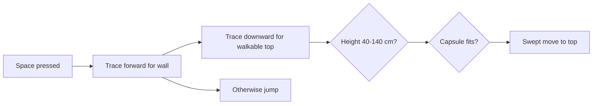

# Movement Physics and C++ Explanation

This is the class-ready explanation for milestone one.

## 1. Walking

The input action supplies a two-dimensional value:

```text
X = right / left
Y = forward / backward
```

The code keeps only the controller's yaw angle, then builds horizontal forward and right unit vectors. This makes WASD follow the direction the player is facing without camera pitch pushing the character into the floor or sky.

```cpp
const FRotator YawRotation(0.0, GetControlRotation().Yaw, 0.0);
const FVector Forward = FRotationMatrix(YawRotation).GetUnitAxis(EAxis::X);
const FVector Right = FRotationMatrix(YawRotation).GetUnitAxis(EAxis::Y);

AddMovementInput(Forward, MovementValue.Y);
AddMovementInput(Right, MovementValue.X);
```

`AddMovementInput` does not teleport the character. It gives `UCharacterMovementComponent` a desired direction. The movement component accelerates toward the allowed velocity, resolves the capsule against the world, applies ground friction, and brakes when input stops.

Important starting values:

| Value | Setting |
|---|---:|
| Walk speed | 400 cm/s |
| Sprint speed | 650 cm/s |
| Crouch speed | 180 cm/s |
| Maximum acceleration | 1,800 cm/s^2 |
| Walking braking deceleration | 1,400 cm/s^2 |
| Air control | 0.35 |

## 2. Looking

Mouse input changes controller yaw and pitch:

```cpp
AddControllerYawInput(LookValue.X);
AddControllerPitchInput(LookValue.Y);
```

Yaw is rotation around the vertical axis; pitch is rotation up and down. The camera uses pawn-control rotation, so it follows these controller angles. Looking changes orientation, not the character's linear position.

## 3. Jumping

Unreal begins a jump by setting upward velocity. Milestone one uses:

```text
Initial vertical speed = 500 cm/s
Gravity = approximately -980 cm/s^2
```

Ignoring collision and air resistance, vertical velocity and height are:

```text
v(t) = v0 + g*t
z(t) = z0 + v0*t + 0.5*g*t^2
```

The ideal time to the highest point is about `500 / 980 = 0.51 s`. The ideal rise is about `500^2 / (2*980) = 127.6 cm`. Actual gameplay results also depend on the capsule, slopes, ceilings, and how long jump input is held.

## 4. Sprinting and crouching

Sprinting and crouching do not replace the movement algorithm. They change its limits:

- Shift selects the 650 cm/s maximum speed.
- Left Ctrl asks Unreal to shrink the character capsule.
- While crouched, maximum speed becomes 180 cm/s.
- The movement-noise multiplier changes from `1.0` while walking to `1.5` while sprinting and `0.25` while crouched.

There are no footstep sounds or enemies yet. The noise multiplier is a clean data hook for those future systems.

## 5. Ledge climbing

Space first attempts a simple mantle and jumps only when no ledge is valid.



The first trace detects a nearby wall. A second trace starts above and behind that wall and searches downward for a walkable top surface. Before moving, a capsule-overlap test checks headroom. The final move uses collision sweeping, so the player cannot pass through blocking geometry.

This is a controlled kinematic mantle, not a force-driven climbing simulation. A later animation can interpolate the same validated start and target positions without changing the detection logic.

## 6. Why the code is separated this way

`APlayerCharacter` decides what the player intends. `UCharacterMovementComponent` performs collision-aware movement. The level supplies ordinary geometry. Projectile, enemy, and objective code stays outside the movement class so milestone one remains understandable and easy to present.
