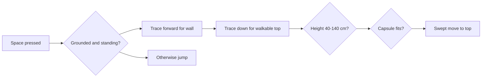

# Input, Movement, and Traversal

This guide explains how physical input becomes player motion in Unreal.

## 1. Input path

The project uses Unreal's Enhanced Input system for movement, looking, and jumping:

```text
Keyboard/mouse
    -> Input Mapping Context
    -> Input Action value or event
    -> APlayerCharacter callback
    -> controller or Character Movement request
    -> collision-aware result in the world
```

`PawnClientRestart()` installs `IMC_Default` and `IMC_MouseLook` for the local player. `SetupPlayerInputComponent()` then binds the action assets:

| Input | Action/callback | Result |
|---|---|---|
| WASD | `IA_Move` -> `Move()` | horizontal movement request |
| Mouse | `IA_MouseLook` -> `Look()` | controller yaw and pitch |
| Space pressed | `IA_Jump` -> `StartJump()` | climb attempt, otherwise jump |
| Space released | `IA_Jump` -> `EndJump()` | stop jump request |
| Left Shift | direct key binding | sprint on/off |
| Left Ctrl | direct key binding | crouch on/off |

Enhanced Input produces intent; it does not move the capsule by itself.

## 2. Walking

`IA_Move` supplies a two-dimensional value:

```text
X = right / left
Y = forward / backward
```

The code keeps only controller yaw and builds horizontal forward/right unit vectors. Camera pitch therefore never pushes the character into the ground or sky.

```cpp
const FRotator YawRotation(0.0, GetControlRotation().Yaw, 0.0);
const FVector Forward = FRotationMatrix(YawRotation).GetUnitAxis(EAxis::X);
const FVector Right = FRotationMatrix(YawRotation).GetUnitAxis(EAxis::Y);

AddMovementInput(Forward, MovementValue.Y);
AddMovementInput(Right, MovementValue.X);
```

`AddMovementInput` records a desired direction. `UCharacterMovementComponent` accelerates toward the permitted velocity, detects floors, slides along blocking geometry, applies friction, and brakes when input stops.

Current tuning:

| Value | Setting |
|---|---:|
| Walk speed | 340 cm/s |
| Sprint speed | 520 cm/s |
| Crouch speed | 150 cm/s |
| Maximum acceleration | 1,300 cm/s² |
| Walking braking deceleration | 1,800 cm/s² |
| Ground friction | 9.0 |
| Air control | 0.18 |

Lower acceleration and air control reduce instant direction changes. Strong braking and ground friction keep stopping deliberate without making the character slide like a light object.

## 3. Looking

Mouse input changes controller yaw and pitch:

```cpp
AddControllerYawInput(LookValue.X);
AddControllerPitchInput(LookValue.Y);
```

Yaw rotates around the vertical axis; pitch looks up and down. The first-person camera uses pawn-control rotation, so it follows those controller angles. Looking changes orientation, not linear position.

## 4. Jumping and gravity

Unreal starts the jump by setting upward velocity. Current values are:

```text
Initial vertical speed = 460 cm/s
Gravity scale = 1.25
Effective gravity = approximately -1,225 cm/s²
```

Ignoring collision, vertical motion follows:

```text
v(t) = v0 + g*t
z(t) = z0 + v0*t + 0.5*g*t²
```

The ideal time to the highest point is about `460 / 1225 = 0.38 s`. The ideal rise is about `460² / (2*1225) = 86 cm`. The shorter rise and faster fall create a heavier jump. Collision, slopes, ceilings, and movement state can change the observed result.

## 5. Sprinting and crouching

Sprint and crouch change movement limits rather than replacing the movement algorithm:

- Shift selects the 520 cm/s sprint speed.
- Left Ctrl asks Unreal to shrink the capsule while grounded.
- Crouching selects the 150 cm/s crouch speed.
- Crouch cancels sprint and cannot begin in mid-air.
- Movement-noise multipliers are `1.0` walking, `1.5` sprinting, and `0.25` crouching.

The noise value is a clean hook for future footsteps or AI hearing.

## 6. Ledge climbing

Space first attempts a mantle and jumps only if no valid ledge is found.



The first trace detects a nearby wall. A second trace searches downward for a walkable top. A capsule-overlap test verifies landing room. The final move uses collision sweeping, so the capsule cannot pass through blocking geometry. A 180 cm ledge intentionally fails the height test.

This is a controlled kinematic mantle. A later animation can interpolate to the same validated target without changing detection rules.

## 7. Landing feedback

`Landed()` reads downward impact speed. Impacts below 480 cm/s do not shake the camera, so an ordinary same-height jump stays calm. Higher drops start a short, damped camera dip and small roll. The response scales with impact speed and restores the camera's original relative transform when finished.
