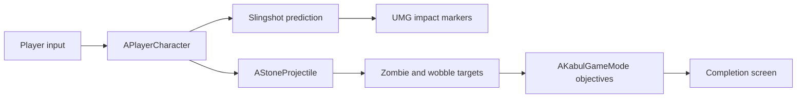
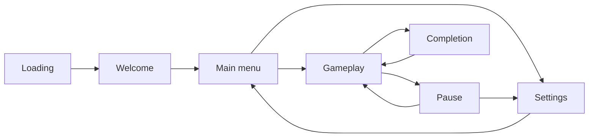

# Project Architecture

## Runtime flow

## Responsibilities

| System | Responsibility |
|---|---|
| `APlayerCharacter` | first-person movement, slingshot input, overdraw reset, projectile launch, settings values, and local UI creation |
| `USlingshotAimGuideComponent` | simulates the same gravity and bounce values as the real stone and returns at most two impacts |
| `AStoneProjectile` | swept movement, two-collision limit, target notification, damage delivery, and timed cleanup |
| `AZombieCharacter` | body-zone damage, stagger, crawling, ragdoll death, and reset |
| `AKabulGameMode` | discovers placed objectives, tracks unique completions, resets progress, and triggers the ending |
| `UKabulPrototypeUI` | loading, welcome, menus, settings, gameplay readout, compact impact markers, pause, and completion |

## Important design decisions

- The predictor and real projectile read the same radius, gravity, bounciness, friction, lifetime, collision channel, and collision limit.
- The trajectory result contains impacts rather than a long list of display points. UMG therefore draws only the information the player needs: a body marker, a short bounce angle, and the final impact.
- Objective progress uses sets of actor references. Repeatedly hitting one target cannot complete another target's objective.
- The local player creates the UMG widget. This keeps the interface working even when an existing Blueprint game mode has older serialized HUD settings.
- Reset restores the player start transform, stones, zombies, wobble targets, and objective progress without reloading the level.

## Screen flow

