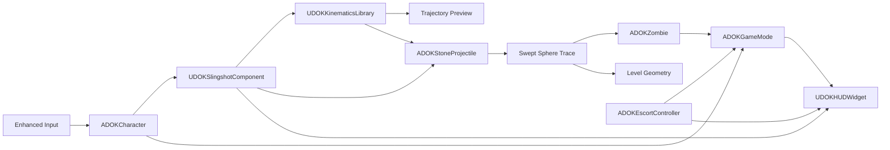
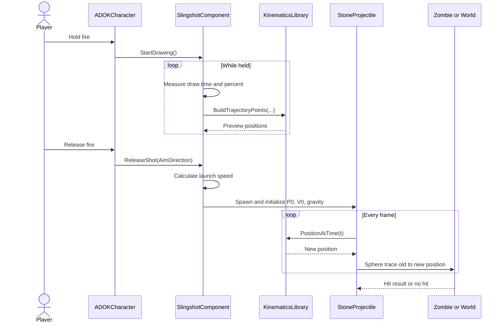
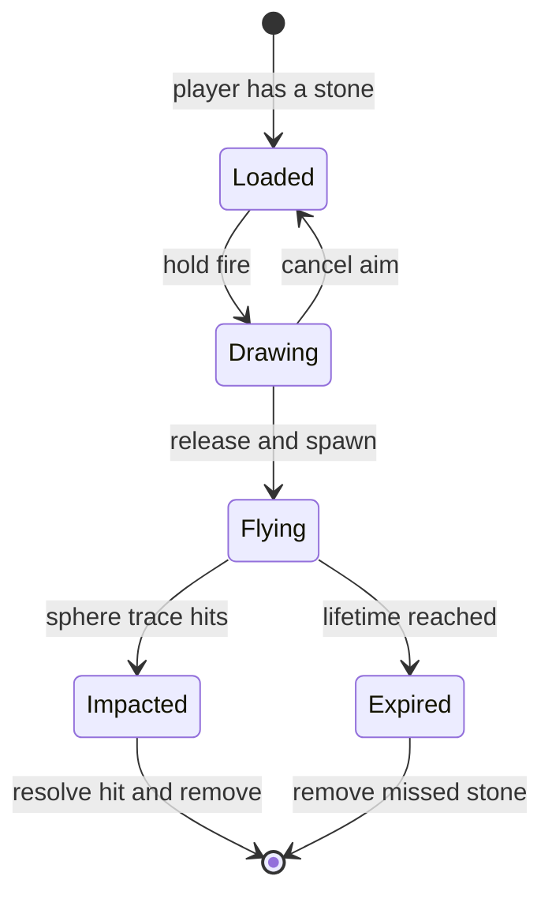
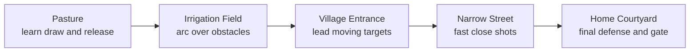

# Project Architecture

## Architecture decision

Build the smallest complete level around one strong technical system: the C++ slingshot projectile. C++ owns rules and physics. Blueprint children own meshes, animation, sound, effects, and exposed tuning values. This keeps the graded physics understandable while still letting the level look polished.

## Scope guardrail

**Minimum build:** one linear level, one player, one slingshot, one stone type, one basic zombie, scripted animals, simple objectives, UI, win/loss, restart, and Windows packaging.

**Not part of the minimum:** multiplayer, inventory screens, skill trees, complex herd AI, rubber-band rope simulation, air resistance, wind, ricochet, procedural levels, Gameplay Ability System, or a full save system.

## System map



The important rule is that the preview and real projectile call the **same math library**. If we write the equation twice, the preview can drift away from the real shot.

## Implemented source structure

The Unreal module now contains this structure:

```text
Source/DarknessOfKabul/
|-- DarknessOfKabul.Build.cs
|-- DarknessOfKabul.cpp
|-- DarknessOfKabul.h
|-- Public/
|   |-- Character/DOKCharacter.h
|   |-- Components/DOKSlingshotComponent.h
|   |-- Physics/DOKKinematicsLibrary.h
|   |-- Projectiles/DOKStoneProjectile.h
|   |-- Enemies/DOKZombie.h
|   |-- Objectives/DOKEscortController.h
|   |-- Pickups/DOKStonePickup.h
|   |-- Game/DOKGameMode.h
|   |-- Game/DOKPlayerController.h
|   `-- UI/DOKHUDWidget.h
`-- Private/
    |-- Character/DOKCharacter.cpp
    |-- Components/DOKSlingshotComponent.cpp
    |-- Physics/DOKKinematicsLibrary.cpp
    |-- Projectiles/DOKStoneProjectile.cpp
    |-- Enemies/DOKZombie.cpp
    |-- Objectives/DOKEscortController.cpp
    |-- Pickups/DOKStonePickup.cpp
    |-- Game/DOKGameMode.cpp
    |-- Game/DOKPlayerController.cpp
    |-- Tests/DOKKinematicsTests.cpp
    `-- UI/DOKHUDWidget.cpp
```

`Public` contains headers that other modules may include. `Private` contains implementation files. Mirrored folders make a class easy to find without putting every file in one giant directory.

## Class responsibilities

| Class | Owns | Must not own |
|---|---|---|
| `ADOKCharacter` | movement, camera, health, interaction, input forwarding | projectile equations or zombie logic |
| `UDOKSlingshotComponent` | draw state, ammo, cooldown, launch speed, spawning, preview request | frame-by-frame projectile movement |
| `UDOKKinematicsLibrary` | pure position, velocity, and trajectory point functions | actors, effects, ammo, or game state |
| `ADOKStoneProjectile` | flight data, time, sphere trace, hit result, lifetime | player input or objective rules |
| `ADOKZombie` | simple state, target movement, damage, stagger, attack, death | global win/loss logic |
| `ADOKEscortController` | route stages, encounter gates, flock danger, home arrival | projectile physics |
| `ADOKStonePickup` | add ammo once and disappear | slingshot flight logic |
| `ADOKGameMode` | level start, win, loss, restart | visual HUD layout |
| `ADOKPlayerController` | install Enhanced Input mapping contexts | movement or gameplay rules |
| `UDOKHUDWidget` | display current values | authoritative gameplay rules |

## The slingshot shot sequence



## Physics model

Draw strength becomes launch speed:

```text
DrawPercent = Clamp(DrawTime / MaxDrawTime, 0, 1)
LaunchSpeed = Lerp(MinLaunchSpeed, MaxLaunchSpeed, DrawPercent)
InitialVelocity = AimDirection * LaunchSpeed
```

Projectile position and velocity use constant acceleration:

```text
P(t) = P0 + V0*t + 0.5*a*t^2
V(t) = V0 + a*t
```

Unreal distance is normally measured in **centimetres**. Our starting gravity is `(0, 0, -980)` cm/s². The starting launch-speed range is 2,500-6,000 cm/s, with a maximum draw time of 1.25 seconds.

We use total flight time in the equation instead of repeatedly adding velocity to position. That gives a stable analytical path and makes the preview easy to match. A swept sphere trace from the previous position to the new position prevents a fast stone from skipping through a thin collider between frames.

## Projectile state flow



## C++ and Blueprint boundary

| C++ owns | Blueprint owns |
|---|---|
| equations and flight update | meshes and materials |
| draw/ammunition rules | animation assets and animation Blueprint |
| collision interpretation | sound and Niagara effect assignments |
| zombie state rules | placed child classes and level dressing |
| objectives and win/loss | tuning values exposed with `EditDefaultsOnly` |

Blueprint is not “less real” than C++. We use it where visual iteration is faster. We keep graded rules in C++ because the course needs to see and explain the physics code.

## Module plan

Start with these dependencies in the game module:

| Module | What gives us | Typical headers |
|---|---|---|
| `Core` | math, strings, containers, logging | `CoreMinimal.h`, `Math/Vector.h` |
| `CoreUObject` | `UObject`, reflection, Unreal classes | `UObject/Object.h` |
| `Engine` | actors, components, world, traces | `GameFramework/Actor.h`, `Engine/World.h` |
| `InputCore` | input key types | `InputCoreTypes.h` |
| `EnhancedInput` | modern input components and actions | `EnhancedInputComponent.h` |

Add these only when their class is implemented:

- `UMG`, `Slate`, and `SlateCore` for the HUD.
- `AIModule` and `NavigationSystem` for zombie navigation.
- `Niagara` only if C++ directly talks to Niagara; Blueprint-only effects do not require a C++ dependency.

## Level plan



Build this as a graybox first. A plain block that proves distance, cover, sightlines, and timing is more valuable than a beautiful area that does not play correctly.

## Two-week delivery plan

| Work day | Required result | Proof before moving on |
|---:|---|---|
| 1 | Create C++ project, input, test map | project compiles and player moves |
| 2 | Kinematics library | measured position/velocity tests pass |
| 3 | Visible stone projectile | stone follows the expected gravity arc |
| 4 | Slingshot draw/release and ammo | weak/full draws show different range |
| 5 | Trajectory preview and sphere trace | preview matches; thin target is hit |
| 6 | Basic zombie and hit zones | head/body hits differ; death works |
| 7 | Objectives, UI, win/loss, restart | complete loop works in test map |
| 8 | Five-zone graybox and simple escort | playable pasture-to-home route |
| 9 | Assets, sound, effects, tuning | complete level is readable and stable |
| 10 | packaging, bug fixing, evidence | clean Windows build and presentation |

Stretch goals wait until the day-10 build already passes. If a required task slips, reduce decoration before reducing physics correctness.

## Test gates

1. **Math gate:** known inputs produce known positions and velocities.
2. **Preview gate:** preview and real projectile share the same input values and function.
3. **Collision gate:** maximum-speed shots cannot cross a thin target unnoticed.
4. **Gameplay gate:** ammo, health, danger, win, loss, and restart work together.
5. **Level gate:** every encounter teaches or tests one physics idea.
6. **Package gate:** the final executable works on a machine without the Editor open.
