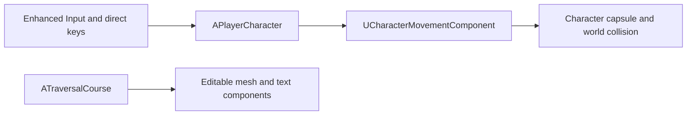

# Milestone-One Architecture

## Current flow

## Responsibilities

| Class | Current responsibility |
|---|---|
| `APlayerCharacter` | camera, input, walking, looking, jumping, sprinting, crouching, movement noise value, and ledge climbing |
| `AKabulPlayerController` | future player-only UI and controller responsibilities; intentionally empty now |
| `AKabulGameMode` | selects the milestone-one player pawn and controller |
| `ATraversalCourse` | editable movement-course geometry and floating guide text only |
| projectile, slingshot, pickup, zombie, and HUD classes | commented future extension points; no current gameplay behavior |

## Scope boundary

Milestone one proves movement and explains its physics. Combat and full-game systems must not be added until a later milestone explicitly begins.
