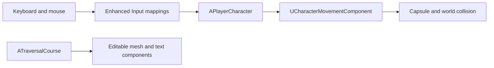

# Project Architecture

## Runtime flow

## Class responsibilities

| Class | Responsibility |
|---|---|
| `APlayerCharacter` | camera, input binding, walking, looking, jumping, sprinting, crouching, landing feedback, movement-noise value, and ledge climbing |
| `AKabulPlayerController` | player-specific UI and controller responsibilities when needed |
| `AKabulGameMode` | selects the default pawn and player controller |
| `ATraversalCourse` | editable traversal-test geometry and floating guide text |
| `USlingshotComponent` | isolated slingshot behavior; currently a small extension point |
| `AStoneProjectile`, `AStonePickup`, `AZombieCharacter`, and `UKabulHUDWidget` | separate gameplay domains that do not belong in locomotion code |

## Ownership rules

- The character translates player intent into movement requests.
- `UCharacterMovementComponent` owns acceleration, velocity, gravity, floor detection, and collision-aware motion.
- The level owns environment layout and art.
- `ATraversalCourse` supplies reusable test geometry, not game rules.
- Game-wide rules belong in `AKabulGameMode`.
- UI belongs in the HUD/widget layer, not in the movement class.

This separation keeps each system testable and prevents movement, combat, level geometry, and UI from becoming one large class.
