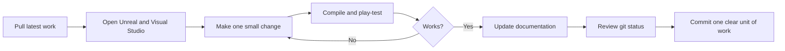

# Setup and Workflow

This guide records the environment setup in plain language. It is written for a student who knows regular C++ but is new to Unreal C++.

## What was already installed

Checked on **July 18, 2026**:

| Tool | Found | Why we need it |
|---|---:|---|
| Unreal Engine 5.6.1 | Yes | Editor, engine headers, build tools, packaging |
| Visual Studio Community 2022 | Yes | Write, compile, and debug C++ |
| Game development with C++ workload | Yes | Installs the MSVC compiler and game-development tools |
| MSVC x64 compiler | Yes | Turns our C++ files into a Windows game module |
| Windows SDK 10.0.22621 and 10.0.26100 | Yes | Windows headers and libraries; UE 5.6 selected 10.0.22621 for the verified build |
| Git | Yes | Records project history and supports teamwork |
| Git LFS 3.7.1 | Yes | Stores large Unreal binary assets safely |
| Fab and Bridge | Yes | Finds and imports permitted external assets |
| Enhanced Input | Yes, built into UE | Modern Unreal input actions and mapping contexts |
| Niagara | Yes, built into UE | Optional impact and trail effects |
| Modeling Tools Editor Mode | Yes, built into UE | Optional quick level blockout tools |

No third-party runtime plugin is needed for the minimum build. This is intentional: every extra plugin adds download, version, packaging, and team-sync risk.

## What the repository setup files do

### `.gitignore`

Unreal creates large temporary folders every time it builds or opens the project. Git ignores those folders because every teammate can regenerate them. The important folders that will remain tracked are `Config`, `Content`, `Plugins`, `Source`, and `Documentation`.

### `.gitattributes`

Unreal `.uasset` and `.umap` files are binary. Git cannot combine two edited versions line by line like it can with C++. Git LFS stores these large binaries outside normal Git history while keeping small pointer files in each commit.

### `.vsconfig`

If another teammate opens this repository in Visual Studio Installer, this file describes the C++ and Windows components the project expects.

### `.editorconfig`

This keeps indentation, UTF-8 text, and line endings consistent across editors. C++ uses tabs with a visual width of four spaces, matching normal Unreal style.

## First local setup after cloning

Run these commands once from the repository root:

```powershell
git lfs install --local
git lfs pull
git status
```

What they mean:

1. `git lfs install --local` connects LFS to this repository.
2. `git lfs pull` downloads the real contents of tracked binary assets.
3. `git status` shows local changes before we work.

## Opening the Unreal project

Open `DarknessOfKabul.uproject` with Unreal Engine 5.6.1. The project starts in `/Game/Maps/L_TargetPractice` and uses `AKabulGameMode`, `AKabulPlayerController`, and `APlayerCharacter` for player movement.

If Unreal asks to rebuild modules, choose **Yes**. A successful Development Editor build has already been verified on this machine. Follow `EDITOR_START_HERE.md` before changing the starter map.

## Plugins and modules: what is the difference?

A **plugin** is a packaged feature that can contain one or more code modules and assets. A **module** is a compiled group of C++ code. Our game itself will have a module named `DarknessOfKabul`.

Planned built-in features:

| Feature | Type | Use now? | Reason |
|---|---|---:|---|
| Enhanced Input | Plugin + module | Yes | Input Actions and mapping contexts for movement, look, and jump |
| UMG | Engine module | Yes | HUD widgets for stones, draw strength, health, danger, and objectives |
| AI Module | Engine module | Later | Basic AI controller support for zombies |
| Navigation System | Engine module | Later | Lets simple zombies move on a NavMesh |
| Niagara | Plugin + module | Optional | Stone trails and impact effects after gameplay works |
| Fab | Editor plugin | Asset import only | Environment and character assets with recorded licences |
| Gameplay Ability System | Plugin | No | Too much framework for one weapon and one level |
| StateTree | Plugin | No | A small explicit zombie state enum is easier to build and explain |
| Cable / Chaos rope simulation | Plugin/system | No | The rubber bands only need visual animation; draw time controls launch speed |

Movement, look, and jump use the existing Enhanced Input assets. Sprint and crouch are intentionally direct key bindings in `PlayerCharacter.cpp` so the input path remains small and readable. There is no firing input in the current player class.

Only add a module to `DarknessOfKabul.Build.cs` when C++ actually uses it. Fewer dependencies mean faster builds and fewer confusing errors.

## Everyday team workflow



Good commit examples:

- `Add kinematic position and velocity helpers`
- `Implement slingshot draw state`
- `Add swept sphere collision for stones`

Avoid a vague commit such as `stuff` because it is difficult to review or undo.

## Asset rules

For every downloaded asset, record:

- asset name and creator/publisher;
- source link;
- licence;
- date downloaded;
- modifications made;
- where it is used.

Add those entries to `Documentation/ASSET_CREDITS.md`. Never assume an asset is allowed just because it can be downloaded.

## If the project does not compile

Check in this order:

1. Read the **first real compiler error**, not the final `Build failed` line.
2. Confirm the class filename and generated header name match exactly.
3. Confirm `#include "ClassName.generated.h"` is the final include in a reflected header.
4. Confirm the needed module is listed in `DarknessOfKabul.Build.cs`.
5. Close the Editor before deleting or regenerating project files.
6. Do not delete `Content`, `Config`, `Source`, or the `.uproject` while troubleshooting.
